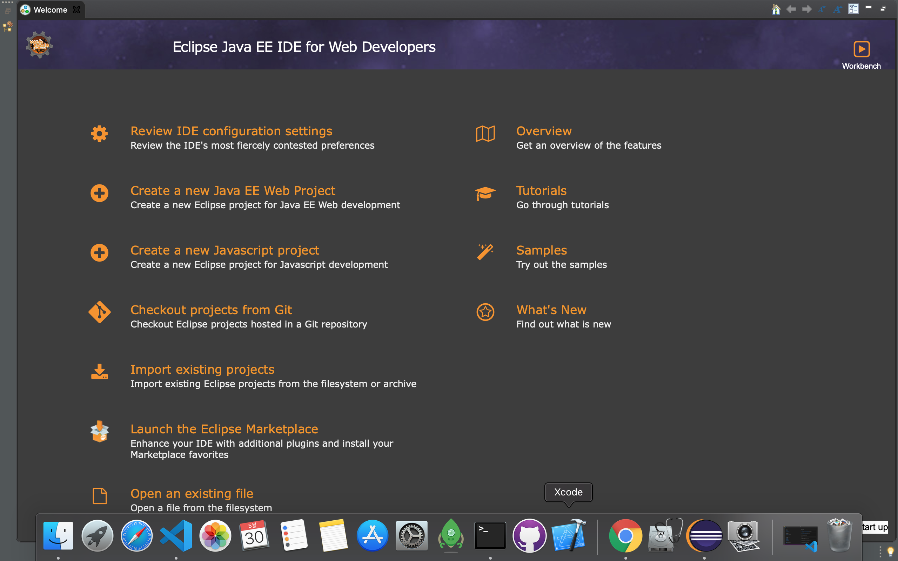

# 맥북 OS에서 자바를 사용하는 방법



윈도우(Windows)는 익숙하지만
맥(Mac) OS를 써봐야지 써봐야지 해봤지만
마음속으로만 미뤄둘뿐 정작 써보니까 진짜 다르고, 윈도우 키보드에 익숙해져서

<br>

한/영 키를 무의식적으로 누르게되는...
그리고 Caps Lock 버튼을 눌러서 영어소문자 누르려고하는데 한글이 나오고...;;;

ctrl, alt에 익숙해져서
control, command, option이 아직도 헷갈린다.

<br>

아직 초보 앱등이/맥등이라서
설치하고 익숙해지는데 시간이 걸리지만
그래도 다양한 OS를 경험할 수 있는게 어디인가!

<hr>

1. homebrew 설치

- 참고: 스파르타 2주차 강의자료
- homebrew란?
  - 다운로드 패키지를 관리할 수 있는 도구이다.

터미널에서 아래와 같이 명령어를 입력하면

```bash
brew install 프로그램이름
```

`프로그램이름`에 해당하는 프로그램을 자동으로 다운로드하게끔 한다.


- (1) 터미널창에 아래 코드를 복사하여 붙여넣는다.

- 단, 해당 계정 사용자는 (관리자)의 권한을 가져야한다는 점 주의하자.

- 코드 복사 붙여 넣기전에, Xcode앱을 활성화 시킨다. 허용하려면 `관리자계정의 비밀번호`를 반드시 입력해야한다.


```bash
/bin/bash -c "$(curl -fsSL https://raw.githubusercontent.com/Homebrew/install/master/install.sh)"
```

- (2) 관리자 계정의 패스워드 입력


<hr>


2. JDK 설치

- openJDK 설치
  - 참고: https://findstar.pe.kr/2019/01/20/install-openjdk-by-homebrew/

- (1) AdoptOpen JDK
  - 나의 경우에는 OpenJDK8을 다운로드했다.

```bash
brew tap AdoptOpenJDK/openjdk

brew cask install adoptopenjdk8
```

- JDK가 제대로 설치했는지 확인

```bash
java -version
```

<br>

```bash
/usr/libexec/java_home
```

<br>

- JDK 설치(ORACLE JDK 11.0.7)
  - [ORACLE JDK 참고 페이지] (https://velog.io/@noyo0123/%EB%A7%A5%EC%97%90%EC%84%9C-%EC%9E%90%EB%B0%94-%EC%84%A4%EC%B9%98-82k3oh0d83)

- 시스템 환경변수 설정하기

 Windows는 시스템환경변수 편집기에서 사용자가 직접 java의 bin 디렉토리 경로를 시스템 환경변수인 PATH에 추가하면 됐지만

 Mac OS는 터미널을 통해서 환경변수에 넣을 수 있다.
 여기서 리눅스 용어를 사용해야한다.
 `vi` 는 파일 쓰기(내용 수정)을 의미한다.

<br>

 `i`는 "파일쓰기 모드" 로 하겠다는 것이고  `esc` 를 누르면 "파일 읽기모드"로 변환한다.

<br>

 `:wq` 는 "현재파일을 저장하고 밖으로 빠져나간다"는 의미이다.

- `.bash_profile`에 들어가서 내용 수정

```bash
vi ~/.bash_profile
```


- 시스템 환경변수 편집 (bash_profile에 추가할 내용)

 ```bash
 export JAVA_HOME=/Library/Java/JavaVirtualMachines/jdk-11.0.7.jdk/Contents/Home

 export CLASSPATH=.:$JAVA_HOME/lib/tools.jar

 export PATH=$PATH:$JAVA_HOME/bin
 ```

<hr>

3. Eclipse 설치

- 이클립스 홈페이지에 들어간다
  - More > Eclipse IDE > Download
- Download 64 bit 버튼 클릭
- `eclipse-inst-mac64.dmg` 링크 클릭
