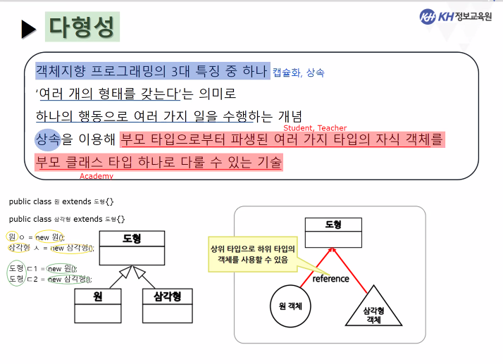
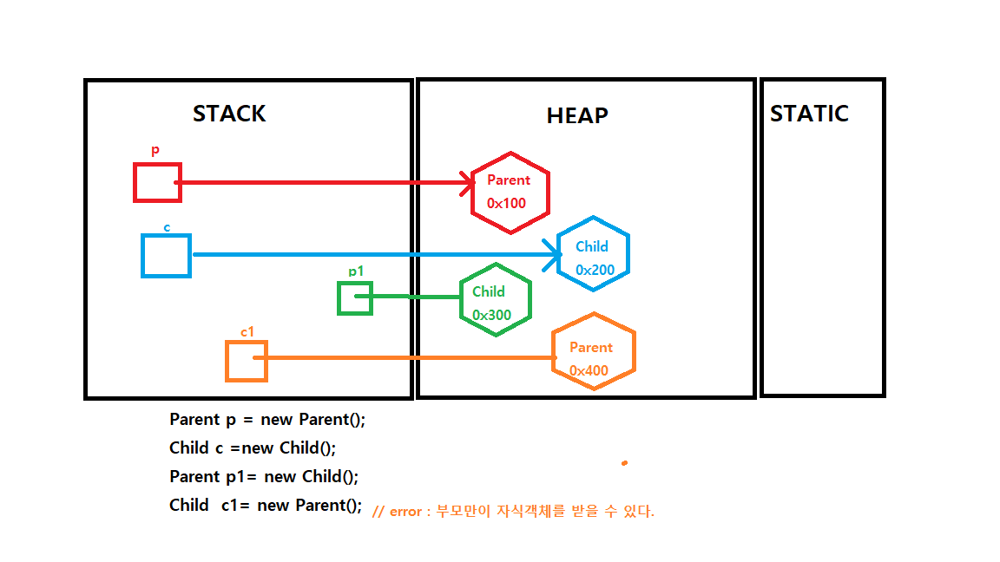

# 객체지향 프로그래밍 3대 특징
- 캡슐화
- 상속
- 다형성
- (추가) 추상화

<hr>

# 오버로딩과 오버라이딩
- 오버로딩
  - 똑같은 이름의 메소드/생성자 를 생성할 수 있다.
  - 다만, ```매개변수의 개수```, ```매개변수 타입```, ```매개변수 순서```에 의해서 오버로딩이 가능하다.

<br>

- 오버라이딩
  - ```부모클래스 에게서 물려받은 메소드를 자식클래스에서 재정의```
  - 자식클래스에서 정의한 메소드는 부모클래스에서의 메소드의 ```매개변수의 개수```, ```매개변수 타입```, ```매개변수 순서```와 ```리턴 타입``` 같아야 한다.
  - 접근제한자는 달라도 되는데, 자식클래스의 접근제한자는 부모클래스의 접근제한자보다 <strong>같거나 더 넓은 범위여야한다.(더 공개적)</strong>
  
<hr>

# 다형성(polymorphism)

> 다양한 형태를 가지고 있다.

``` 
(나)를 바라보는 누구의 따라서 다르다

부모님 에게 있어서 '나'는 자식이고

언니/오빠/누나/형 에게 있어서 '동생'이고

동료들에게 있어서는 '동료'

애인에게 있어서는 '사랑스러운 사람'

할머니/할아버지에게 있어서 '손주'

자식에게 있어서 '부모님'
```

<br>

> 상속이 기본 전제
> 부모 타입으로부터 파생된 여러가지 타입의 자식 객체를 <strong>부모클래스 타입 하나로 다룰 수 있는 기술.</strong>

<br>

- 상속


```java
// Figure.java
public class Figure{
}
```

```java
// Triangle.jav
// 부모 클래스 : Figure
public class Triangle extends Figure{
}

```

```java
// Circle.java
// 부모 클래스 : Figure
public class Circle extends Figure{
  
}
```

- 다형성의 기본전제는 ``상속``이다.
- 다형성을 통해서 가능하게 된다.
- 자식객체를 부모클래스 타입으로 받을 수 있다.

<BR>



<BR>
  
  
```java
// 기존 객체 호출
// 원 생성
Circle circle =new Circle();

// 삼각형 생성
Triangle triangle = new Triangle();

//다형성을 이용
//부모클래스 타입으로 하여 자식클래스를 생성할 수 있다.

Figure circle2= new Circle();
Figure tirangle2= new Triangle();

// 도형배열을 만들어서 여러 도형을 만든다.
// 즉 각 원소의 타입을 도형(부모=상위)클래스 로하여
// 하위클래스(자식)인 원과 삼각형을 만들 수 있다.
Figure figureArray1= new Figure[5];


// 모든 객체의 부모는 Object이다.
Object figureArray2= new Figure[5];

```

<hr>




- 업캐스팅(Up casting)
  - 다형성 = 업캐스팅 = 부모클래스가 자식클래스를 받아들이는 것.
  - <STRONG>다형성: 여러 자식객체를 부모클래스 타입으로 다룰 수 있는 (받아 들일 수 있는) 기술</STRONG>
  
  <BR>
  
  - 상속관계에 있는 부모, 자식 클래스 간에 부모 타입의 참조형 변수가 모든 자식 타입 객체 주소를 받을 수 있음.
  - 자식객체의 주소를 전달받은 부모타입의 참조변수를 통해서 사용할 수 있는 후손의 정보는 <strong>원래 부모타입이었던 멤버만 참조가능</strong>
  
  - 부모객체만이 자식객체를 받을 수 있다.
    - 부모가 있어야 자식을 만들 수 있으니까
    - 자식객체가 부모객체를 담는다? 말도안됨.
    
- 다운캐스팅(Down Casting)
  - <strong>```자식객체의 주소를 받은 부모 참조형 변수를 가지고 있는 자식의 멤버를 참조```</strong>해야할 경우
  - 부모 클래스 타입의 참조형 변수를 <strong>```자식 클래스 타입으로 형 변환```</strong> 하는 것.
  
  <br>
  
  - 클래스간의 형변환은 반드시 상속관계에 있는 클래스끼리만 가능하다.
  
  ```java
  // Parent.java
  ```

  <br>
  
  - 다형성은 오버로딩을 줄여줄 수 있다.
  
    ```JAVA
    Car [] carArr= new Car[3];
    
    // 클래스 Car는 Sonata, Avante, Spark 클래스의 부모클래스이다.
    carArr[0]= new Sonata(); 
    carArr[1]= new Avante();
    carArr[2]= new Spark();
    
    //다형성 적용
    public void driveCar(Car car){
    }
    ```
    
    - 다형성이적용되어 있지 않다면 -> 각 자식객체별로 매개변수를 받아서 해야함. -> 오버로딩이 늘어남.
    - 부모클래스를 매개변수로 함으로써, 여러 자식클래스로 접근할 수 있다. -> 메소드 오버로딩을 줄일 수 있다.
    
      ```java
      public void driveCar(Sonata s){}
      public void driveCar(Avante a){}
      public void driveCar(Spark p) {}
      ```

<hr>

# instanceof

  - 현재 참조형 변수가 어떤 클래스형의 객체 주소를 참조하고 있는지를 확인할 때 사용하는 연산자
  - 클래스 타입이 맞으면 true, 맞지않으면 false로 반환.

  ```java
  if( 레퍼런스 instanceof 클래스타입){
    if문 조건이 true일때 실행블록.
    down-casting진행.
  } 
  ```
  
  ```java
  if( car instanceof Sonata){
    ((Sonata) car).moveSonata();
  } else if( car instanceof Avante){
    ((Avante) car).moveAvante();
  } else if( car instanceof Spark){
    ((Spark) car).moveSpark();
  }
  ```

<hr>

# 동적바인딩

- 실제 실행할 메소드 코드와 호출하는 코드를 연결 시키는 것
- 프로그램이 실행되기 전에 컴파일이 되면서 모든 메소드는 정적 바인딩 됨
- 컴파일 시 정적 바인딩된 메소드를 실행할 당시의 객체 타입을 기준으로 바인딩 되는 것.

<br>

- (오버라이딩정의) 
  - 자식클래스가 상속받은 부모 메소드를 재작성 하는 것.
  - 부모가 제공하는 기능을 후손이 일부 고쳐 사용하겠다는 의미로
  - <strong> 자식객체를 통한 실행시 후손 것이 우선권을 가짐. </strong>
    - 여기서 동적 바인딩이 적용됨.

<br>

  - 정적바인딩
    - 처음부터 ~게 실행할게요 라고 컴파일
    - 컴파일 했을 때 바인딩 코드를 그대로 실행.

<br>

- 동적바인딩 성립 조건
  - 상속관계
  - 다형성 적용
  - 메소드 오버라이딩
  - 오버라이딩 된 메소드 코드를 우선적으로 수행.

<hr>

# 추상클래스

## 추상클래스(abstract class)
- 몸체가 없는 메소드(추상메소드)를 포함한 클래스
- 추상클래스의 경우 클래스 선언부에 abstract 키워드 사용

```java
[접근제한자] abstract class 클래스명{}
```

<BR>

## 추상메소드
- <STRONG>몸체가 없는 메소드</STRONG>
- 추상메소드의 선언부에 abstract 키워드 사용
- <strong>상속시 반드시 구현해야하는, 오버라이딩이 강제화되는 메소드</strong>

```java
[접근제한자] abstract 반환형 메소드이름 (자료형 변수이름);
```


- 추상클래스의 특징
  - 미완성된 클래스 (abstract 키워드 사용)
    - <strong>자체적으로 객체를 생성할 수 없다.</strong>
    - <strong>반드시 상속을 하여 객체를 생성한다.</strong>
    
  <br>

  - abstract 메소드가 포함된 클래스는 반드시 abstract 클래스이다.
    - <strong>abstract 메소드가 없어도, abstract 클래스로 선언이 가능하다.</strong>
    - 추상메소드가 있다 => 무조건 추상 클래스
    - 추상클래스 안에 추상메소드가 있을 수도 있고, 없을 수도 있다. / 추상클래스 안에 완성된 메소드도 존재할 수 있다.
  
  <br>
  
  - 클래스 내에 일반 변수, 메소드를 포함할 수 있다.
  
  - 추상클래스 생성자를 갖고 있지만, 객체를 만들 수 없다.
  - 객체 생성은 안되지만, <strong>참조형 변수 타입으로는 사용가능</strong>


- 추상 클래스의 장점
  - 일관된 인터페이스 제공
  - 꼭 필요한 기능을 강제화(공통적이나 자식클래스에서 특수화된 기능) => 자식클래스(하위클래스) 모두가 갖도록함.
  
<hr>

# 인터페이스(interface)

- <strong>상수형(final붙어있음) 필드와 추상 메소드만을 작성할 수 있는 추상클래스의 변형체</strong>
  - 그 안에 일반 메소드는 인터페이스 안에 들어있을 수 없다.
  
- 메소드 통일성을 부여하기 위해 추상메소드만 따로 모아놓은 것

- <strong>상속 시 인터페이스 내에 정의된 모든 추상메소드를 구현해야함.</strong>

```java
// [ ] : 생략가능

[접근제한자] interface 인터페이스명{
  //상수도 멤버로 포함할 수 있다.
  [public] [static] [final] 자료형 변수명=초기값;
  
  //추상메소드만 선언 가능
  [public] [abstarct] 반환자료형 메소드명 ([자료형] [매개변수]);
    // public abstract 가 생략되기 때문에
    // 오버라이딩 시 반드시 public 표기해야함.
}
```

- 인터페이스의 특징
  - 모든 인터페이스의 메소드는 묵시적으로 public이고 abstract
  - 변수는 묵시적으로 public static final
    - 따라서 인터페이스 변수의 값 변경을 하면 에러발생.
    
  - 객체 생성은 안되나 <strong>참조형 변수로는 가능하다.</strong>

- 장점
  - 상위 타입 역할로 다형성을 지원하여 연결
  - 해당 객체가 다양한 기능 제공시에도 인터페이스에 해당하는 기능만을 사용하게 제한 가능
  - 공통 기능 상의 일관성 제공
  - <strong>공동 작업을 위한 인터페이스 제공</strong>
  
<hr>  
 
# 추상클래스와 인터페이스의 차이점은 무엇인가?

- 클래스(추상클래스 포함)는 단일상속만 가능  
- 인터페이스는 다중상속이 가능

  
  
  
