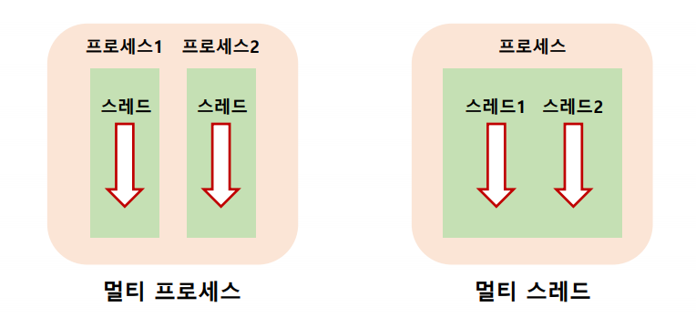
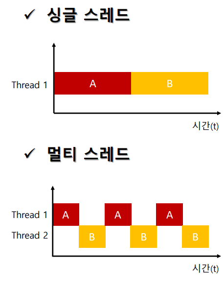
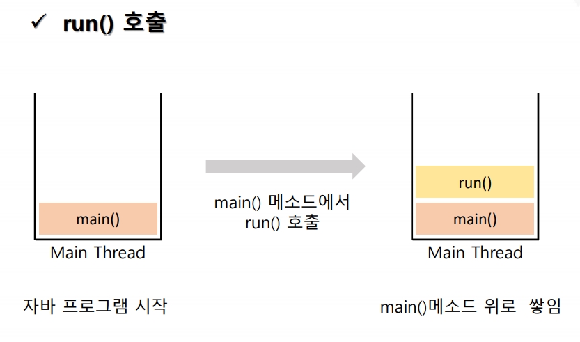
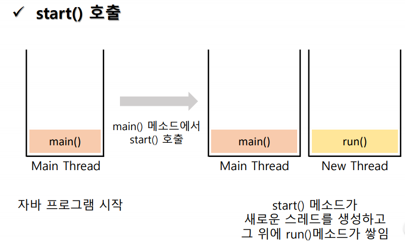
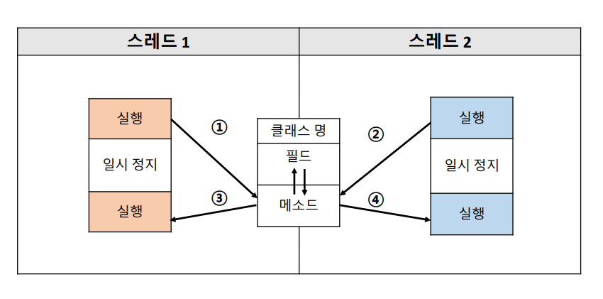

# 프로세스(process)

- 간단한 의미로 <strong>실행중인 프로그램</strong>

- 프로세스는 프로그램이 실행될 때마다 개별적으로 생성

- 하나의 프로세스는 프로그램을 수행함에 있어 필요한 데이터와
  메모리 등의 할당 받은 자원, 그리고 하나 이상의 스레드(thread)로 구성.
  - 작업단위마다 스레드가 존재한다.
    - 작업단위는 독립적임.

  - 스레드가 있어야만, 프로그램이 동작할 수 있다.


- *reference : Operating System - Process & Threads*

<hr>

# 스레드(Thread)

- 모든 자바 프로그램은 메인 스레드가 main() 메소드를 실행하며 시작
  - main()은 첫 코드부터 아래로 순차적으로 실행되고
  - return을 만나면 종료
  - 필요에 의해 작업 스레드들을 만들어서 병렬 코드 실행 가능
  - 멀티스레드를 이용한 멀티태스킹

- 프로세스 종료
  - 스레드가 종료해야 프로세스를 종료할 수 있다.

  - 1. Single Thread
    - 하나의 스레드(메인 스레드)가 종료되면 프로세스 종료

  - 2. Multi Threads
    - 하나의 스레드가 종료되면, 다른 스레드가 끝날 때까지 기다린다.

- 멀티프로세스 vs 멀티스레드
  - 멀티프로세스: 실행중인 프로그램(프로세스)가 여러개
  - 멀티스레드: 하나의 프로세스안에서 실행중인 스레드가 여러 개가 동시에 작업.

  

  <BR>

  
  - 싱글 스레드: 메인 스레드 하나만 가지고 작업 처리
  - 멀티 스레드: 메인 스레드 외의 추가적인 스레드를 이용하여 병렬적으로 작업 처리.

  <hr>

# 멀티스레드의 장점과 단점

- 동기화(Synchronization)에 주의

- 교착상태(Dead Lock)이 발생하지 않도록 주의

<br>

# Generate Thread

```java
public class 클래스명 extends Thread{
  //상속 처리 후 run()메소드 오버라이딩

  // 오버라이드 하여 내가 만들고 싶은대로 만듦.
  @Override
  public void run(){
    //사용자 정의로 작업 코드를 만든다.
  }
}
```  

```java
public class Run{
  public static void main(String [] args){
    클래스명 ref= new 생성자();
    ref.start(); //스레드를 제대로 실행

    // ref.run(); (wrong)
    // stack에 main메소드 위에 run이 쌓임
    // run()메소드는 그냥 실행만함.
    // 하나의 스레드에 쌓이게되는 구조.

    // ref.start()
    // main()이 실행됨과 동시에. start()로 인해서
    // 내가 새로만든 스레드가 생성됨과 동시에 실행.
    // 새로운 스택영역에 run()메소드가 생김.
    // Thread를 상속받은 클래스의 run()메소드를 실행이 아님.
  }
}
```

- run() 과 start()
  - run()
  

  <br>

  - start()
  

  <BR>

<hr>


- Runnable 인터페이스를 상속하는 경우
  - Runnable 인터페이스는 start()메소드가 없다.
  - thread 래퍼런스 변수를 만들어서 그 thread의 start()를 호출.

```java
public class 클래스명 implements Runnable{
  //상속 처리후 run()메소드 오버라이드
  @Override run(){
    //작업 코드
  }
}
```

```java
public class Run{
  public static void main(String[] args){
    클래스명 ref =new 생성자(); //Runnable을 구현한 객체생성
    Thread thread= new Thread(ref);
    thread.start();
  }
}
```

<HR>

# 스레드 실습

- Thread1.java
```java
package com.kh.example.chap01_thread.thread;

public class Thread1 extends Thread{
	//스레드 생성
	//1. 스레드 클래스를 상속받는 방법
	//2. 러너블 인터페이스 구현

	//1. 스레드 클래스를 상속받는다.
	//run메소드 오버라이딩

	@Override
	public void run() {
		for(int i=0; i<10; i++) {
			System.out.println(getName()+" on....");
			//getName(): thread이름을 반환.
			// 이름지정이 가능하고, 지정을안하면 알아서 스레드이름을 지정.

			// sleep(): 스레드를 지연시키는 메소드
			// 기본단위: ms (1s=1000ms)
			// Unhandled exception type InterruptedException
			// => try catch 문 이용.
			try {
				Thread.sleep(500); //0.5s
			} catch (InterruptedException e) {
				e.printStackTrace();
			}
		}
	}
}

```

- Thread2.java
```java
package com.kh.example.chap01_thread.thread;

//Thread 생성 - Runnable 인터페이스를 이용해서 구현.
// => run()메소드를 오버라이딩.
public class Thread2 implements Runnable{

	@Override
	public void run() {
		for(int i=0; i<10; i++) {
			// Thread.currentThread() => 지금 동작하고 있는 스레드
			System.out.println(Thread.currentThread().getName()+".. on");
			try {
				Thread.sleep(500);
			} catch (InterruptedException e) {
				e.printStackTrace();
			}
		}
	}
}

```

- Thread3.java
```java
package com.kh.example.chap01_thread.thread;

public class Thread3 implements Runnable {

	@Override
	public void run() {
		//thread이름을 수정
		Thread.currentThread().setName("Runnable 인터페이스를 상속받은 스레드");

		//thread우선순위 수정
		Thread.currentThread().setPriority(4);

		for(int i=0; i<10; i++) {
			System.out.println("thread3("+i+")=> "+Thread.currentThread().getName()+" ...!");
			try {
				Thread.sleep(1000); //1초지연
			} catch (InterruptedException e) {

				e.printStackTrace();
			}
		}

	}
}
```

- Thread4.java
```java
package com.kh.example.chap01_thread.thread;

public class Thread4 extends Thread{
	@Override
	public void run() {
		// 스레드 이름 수정
		setName("Thread객체를 상속받은 스레드");

		//스레드 우선순위 수정
		setPriority(MAX_PRIORITY);

		for(int i=0; i<10; i++) {
			System.out.println("thread4("+i+")=>"+getName());
			try {
				sleep(1000); //1s 지연.
			} catch (InterruptedException e) {
				e.printStackTrace();
			}
		}
	}
}
```

- Run.java
```java
package com.kh.example.chap01_thread.run;

import com.kh.example.chap01_thread.thread.Thread1;
import com.kh.example.chap01_thread.thread.Thread2;
import com.kh.example.chap01_thread.thread.Thread3;
import com.kh.example.chap01_thread.thread.Thread4;

public class Run {
	public static void main(String[] args) {
		Thread1 thread1= new Thread1();

//		thread1.run(); //=> 새로운 스레드를 만들지 않음.
		/*thread1.run() 결과
		 * 	Thread-0 on....
			Thread-0 on....
			Thread-0 on....
			Thread-0 on....
			Thread-0 on....
			Thread-0 on....
			Thread-0 on....
			Thread-0 on....
			Thread-0 on....
			Thread-0 on....
			------------------main() End!
		 * */


		thread1.start(); //=> 순서가 바뀌어서 나온다.
		/*thread1.start(); 결과
		 	------------------main() End!
			Thread-0 on....
			Thread-0 on....
			Thread-0 on....
			Thread-0 on....
			Thread-0 on....
			Thread-0 on....
			Thread-0 on....
			Thread-0 on....
			Thread-0 on....
			Thread-0 on....
		 * */

		// Runnable을 상속받기 때문에, start()메소드가 인터페이스에 정의x
		// thread객체 하나 만들어서 start()메소드를 실행.
		Thread2 thread2= new Thread2();
		Thread t2=new Thread(thread2); //Thread객체를 만든다.
		t2.start();
		/*
		 	Thread-0 on....
			------------------main() End!
			Thread-1.. on
			Thread-0 on....
			Thread-1.. on
			Thread-0 on....
			Thread-1.. on
			Thread-0 on....
			Thread-1.. on
			Thread-0 on....
			Thread-1.. on
			Thread-0 on....
			Thread-1.. on
			Thread-0 on....
			Thread-1.. on
			Thread-0 on....
			Thread-1.. on
			Thread-0 on....
			Thread-1.. on
			Thread-0 on....
			Thread-1.. on
		 * */

		// setName으로 스레드 이름을 수정.
		Thread3 thread3= new Thread3();
		Thread realThread=new Thread(thread3);
		realThread.start();

		Thread4 thread4= new Thread4();
		thread4.start();
		/*실행할때마다 결과가 달라진다.
		 	Thread-0 on....
			Thread-1.. on
			thread3(0)=> Runnable 인터페이스를 상속받은 스레드 ...!
			------------------main() End!
			thread4(0)=>Thread객체를 상속받은 스레드
			Thread-1.. on
			Thread-0 on....
			thread3(1)=> Runnable 인터페이스를 상속받은 스레드 ...!
			Thread-1.. on
			thread4(1)=>Thread객체를 상속받은 스레드
			Thread-0 on....
			Thread-0 on....
			Thread-1.. on
			Thread-0 on....
			thread4(2)=>Thread객체를 상속받은 스레드
			Thread-1.. on
			thread3(2)=> Runnable 인터페이스를 상속받은 스레드 ...!
			Thread-0 on....
			Thread-1.. on
			thread3(3)=> Runnable 인터페이스를 상속받은 스레드 ...!
			thread4(3)=>Thread객체를 상속받은 스레드
			Thread-0 on....
			Thread-1.. on
			Thread-0 on....
			Thread-1.. on
			Thread-0 on....
			thread4(4)=>Thread객체를 상속받은 스레드
			Thread-1.. on
			thread3(4)=> Runnable 인터페이스를 상속받은 스레드 ...!
			Thread-1.. on
			Thread-0 on....
			thread3(5)=> Runnable 인터페이스를 상속받은 스레드 ...!
			thread4(5)=>Thread객체를 상속받은 스레드
			thread3(6)=> Runnable 인터페이스를 상속받은 스레드 ...!
			thread4(6)=>Thread객체를 상속받은 스레드
			thread4(7)=>Thread객체를 상속받은 스레드
			thread3(7)=> Runnable 인터페이스를 상속받은 스레드 ...!
			thread4(8)=>Thread객체를 상속받은 스레드
			thread3(8)=> Runnable 인터페이스를 상속받은 스레드 ...!
			thread4(9)=>Thread객체를 상속받은 스레드
			thread3(9)=> Runnable 인터페이스를 상속받은 스레드 ...!
		 * */

		// 각 스레드들의 우선순위를 알아보기 : getPriority()
		System.out.println("thread1 우선순위: "+ thread1.getPriority()); //우선순위: 5
		System.out.println("thread2 우선순위: "+ t2.getPriority());// 우선순위 : 5

		// 스레드 우선순위 기본값: 5
		// 스레드 우선순위 번호가 클수록, 우선순위가 높다.
		// MAX_PRIORITY: 10 = 10이 가장 우선순위가 높다.

		// setPriority()로 우선순위 변경.
		System.out.println("thread3 우선순위: "+ realThread.getPriority()); // 우선순위 4로 수정.
		System.out.println("thread4 우선순위: "+ thread4.getPriority()); // 우선순위 10

		System.out.println("------------------main() End!");
	}
}
```

<HR>

# 스레드 컨트롤

- 실행중인 스레드의 상태를 제어하기 위한 것
- 효율적이고 정교한 스케쥴링을 위한 스레드 상태를 제어하는 기능.


## 스레드 컨트롤 실습
- Thread4.java
```java
package com.kh.example.chap02_control.thread;

public class Thread4 implements Runnable{
	/*
	 * sleep(): 지정된 시간동안 스레드를 일시정지 시키는 메소드
	 * 		지정시간이 다되거나 interrupt()가 호출되면
	 * 		sleep에서 깨어나 실행대기 상태가 됨
	 * 		interrupt() 호출시 InterruptException 예외가 발생되므로
	 * 		try-catch 예외처리를 통해서 처리할 수 있다.
	 * */

	@Override
	public void run() {
			//이름도 바꿔야지.
			Thread.currentThread().setName("너무 졸린 스레드");
			try {
				System.out.println(Thread.currentThread().getName()+"시작!");
				for(int i=0; i<10; i++) {
					Thread.sleep(1000);
					System.out.println((i+1)+"초");
				}

			} catch (InterruptedException e) {
				e.printStackTrace();
			}
			System.out.println("카운트 종료");
	}
}
```

<br>

- Thread5.java
```java
package com.kh.example.chap02_control.thread;

/*
 * interrupt(): 스레드 작업을 취소 시키는 메소드
 *
 * void interrupt()
 * 	=> interrupted필드 기본값 false
 * 	=> 현재 스레드 내부에 interrupted라는 필드값을 true로 바꿔줌으로써
 * 	=> 스레드에 현재 작업을 취소하라고 요청.
 *
 * boolean isInterrupted()
 * 	=> 스레드에 있는 interrupted 필드값을 반환
 *
 *
 * static boolean interrupted()
 * 	=> 현재 스레드 interrupted상태를 반환하고 false값으로 초기화
 * */

public class Thread5 implements Runnable{
	@Override
	public void run() {
		Thread current= Thread.currentThread();
		current.setName("너무 피곤한 스레드2");


		int count=0;
		System.out.println(current.getName()+"시작!");
		while(count<10 && !current.isInterrupted() ) {
			//현재  (!isInterrupted()=interrupted필드 값)이 false일때 진행.
			try {
				//1s 지연
				Thread.sleep(1000);
				System.out.println((++count)+"초");

			} catch (InterruptedException e) {
				//인터럽트 발생순간
				// 언제 카운트가 종료하는지 프린트
				System.out.println(count+"초에 카운트 종료!");

				//인터럽트를 true로 만들어서 현재 작업을 취소..
				//그렇게 의도햇는데도, 의도대로 안됨.
				// => InterruptedException
				/*
				 if (Thread.interrupted())  // Clears interrupted status!
      					throw new InterruptedException();

      			=> InterruptedException이 발생이 일어나면,
      			=> interrupted 값 상태를 false로 다시 초기화.
				 * */

				//이미 인터럽트가 발생했고, interrupted가 false로 초기화됐기때문에
				//현재 상태의 인터럽트상태값을 true로 바꾼다.
				current.interrupt();
			}
		}
	}
}

```

<br>

- InterruptedController.java
```java
package com.kh.example.chap02_control.controller;

import java.util.Scanner;

import com.kh.example.chap02_control.thread.Thread5;

public class InterruptController {
	public void sleepInterrupt() {
		Thread5 t5= new Thread5();
		Thread realThread= new Thread(t5);
		realThread.start();

		//사용자로부터 값을 받는다.
		Scanner sc= new Scanner(System.in);
		System.out.print("Please input any value: ");
		String input=sc.nextLine();
		System.out.println("입력한 값: "+ input);

		//입력값을 받는 동시에 스레드를 종료-> interrupt
		realThread.interrupt();

		sc.close();
	}
}
```

<br>

- Run.java
```java
package com.kh.example.chap02_control.run;

import com.kh.example.chap02_control.controller.InterruptController;
import com.kh.example.chap02_control.thread.Thread4;

public class Run {
	public static void main(String[] args) {
		Thread4 t4= new Thread4();
		Thread realThread= new Thread(t4);
		realThread.start();
		/*(실패) 사용자의 입력을 하면 멈춰야되는데, 계속 10초까지 진행
		 	너무 졸린 스레드시작!
			1초
			2초
			DFASFS3초

			4초
			DASFDS5초

			6초
			DFADS7초

			8초
			9초
			10초
			카운트 종료
		 * */

     //Thread5.java 를 이용하여...사용자가 입력하는 순간
     //인터럽트발생시켜서 스레드활동을 중단.
		InterruptController ic=new InterruptController();
		ic.sleepInterrupt(); // 계속 카운트 10 될때까지 계속 진행. => 인터럽트 사용실패..ㅠ => Thread5.java에서 실패를 개선시켜서 성공함.
		/*
		 	너무 피곤한 스레드2시작!
			Please input any value: 1초
			2초
			dd3초

			4초
			입력한 값: dd
			4초에 카운트 종료!
		 * */

	}
}
```

<hr>

# 동기화(Synchronized)



- 한번에 한개의 스레드만 프로세스 공유자원(객체)에 접근할 수 있도록
- 락(Lock)을 걸어 다른 스레드가 진행 중인 작업에 간섭하지 못하도록 하는 것

- 동기화가 왜 좋지?
  - 스레드는 여러 개인데 자원은 하나


- 동기화를 많이하면, 성능이 안 좋아짐.
- 동기화를 제공해주는 예약어: synchronized

- 사용법
  - 동기화 메소드
    ```java
    public synchronized void method(){
      //한개의 스레드만 실행
    }
    ```
  - 동기화 블록
    ```java
    public void method1(){
      //여러 스레드를 실행할 수 있다.

      synchronized (공유객체){
        //한개의 스레드만 실행할 수 있다.
      }

      //여러스레드를 실행할 수 있음.
    }
    ```

<hr>

## 동기화 예제

- Resources.java
```java
package com.kh.example.chap03_sync.resource;

public class Resources {
	private int data;
	private boolean empty=true; //값이 비어있는지 확인

	public synchronized void getData() {
		//동기화블록 적용
		while(empty) { //data에 값이 없으면
			try {
				wait(); //기다린다.
			} catch (InterruptedException e) {
				e.printStackTrace();
			}
		}
		empty=true; //값이 없는 상태임을 알림.
		System.out.println("소비자: "+ data+"번 상품을 소비하였습니다.");
		//소비하고 나서 깨운다.
		notify();

	}

	public synchronized void setData(int data) { //계속 기다리고 있는 상태 -> 누군가하나를 깨워줘야하는 상태 (교착상태=dead lock)
		//값이 없음.
		while(!empty) {
			//이미 있으면 또 만들 필요 없음
			//소비할때까지 기다린다.
			//data의 값이 있으면 지금 만들 필요없음.-> 기다림
			try {
				wait();
			} catch (InterruptedException e) {
				e.printStackTrace();
			}
		}

		this.data=data;
		empty=false; //미리 생산하기전에 필드값을 바꿔놓는 작업.
		System.out.println("생산자: "+ data+"번 상품을 생산하였습니다.");
		//생산하고 나서 깨운다.
		notify();
	}
}

```

- Consumer.java
```java
package com.kh.example.chap03_sync.thread;

import com.kh.example.chap03_sync.resource.Resources;

public class Consumer extends Thread{
	//소비자는 공유자원을 사용한다.
	private Resources criticalData;

	public Consumer() {}
	public Consumer(Resources resources) {
		criticalData=resources;
	}

	@Override
	public void run() {
		for(int i=1; i<=5; i++) {
			criticalData.getData();

			try {
				Thread.sleep(1000);
			} catch (InterruptedException e) {
				e.printStackTrace();
			}
		}
	}
}

```

- Producer.java
```java
package com.kh.example.chap03_sync.thread;

import com.kh.example.chap03_sync.resource.Resources;

public class Producer extends Thread {

	private Resources criticalData;

	public Producer() {}
	public Producer(Resources resources) {
		criticalData=resources;
	}

	@Override
	public void run() {
		for(int i=1; i<=5; i++) {
			criticalData.setData(i);
			try {
				Thread.sleep(1000);
			} catch (InterruptedException e) {
				e.printStackTrace();
			}
		}
	}
}

```


- Run.java
```java
package com.kh.example.chap03_sync.run;

import com.kh.example.chap03_sync.resource.Resources;
import com.kh.example.chap03_sync.thread.Consumer;
import com.kh.example.chap03_sync.thread.Producer;

public class Run {
	public static void main(String [] args) {
		Resources resource= new Resources();

		Producer p=new Producer(resource);
		Consumer c=new Consumer(resource);
		p.start();
		c.start();
		/* 생산->소비 가 올바른 순서
		 * (problem) 소비->생산 은 엉뚱한 순서.(실제상황에서도 안맞음)
		 *
		 * (solution)
		 * => 동기화 필요.
		 * => 내가 사용하고 있을때는 작업이 다끝날때까지
		 *    다른스레드가 접근못하도록 막아야함. (Resources.java수정)
		 * [trial]
		 *
		 	생산자: 1번 상품을 생산하였습니다.
			소비자: 1번 상품을 소비하였습니다.

			소비자: 2번 상품을 소비하였습니다.
			생산자: 2번 상품을 생산하였습니다.

			소비자: 3번 상품을 소비하였습니다.
			생산자: 3번 상품을 생산하였습니다.

			생산자: 4번 상품을 생산하였습니다.
			소비자: 4번 상품을 소비하였습니다.

			생산자: 5번 상품을 생산하였습니다.
			소비자: 5번 상품을 소비하였습니다.
		 * */

		/*
		 * [error messages] => synchronized를 붙여야한다.
		 	Exception in thread "Thread-1" java.lang.IllegalMonitorStateException
			at java.lang.Object.wait(Native Method)
			at java.lang.Object.wait(Unknown Source)
			at com.kh.example.chap03_sync.resource.Resources.getData(Resources.java:11)
			at com.kh.example.chap03_sync.thread.Consumer.run(Consumer.java:17)

			Exception in thread "Thread-0" java.lang.IllegalMonitorStateException
			at java.lang.Object.wait(Native Method)
			at java.lang.Object.wait(Unknown Source)
			at com.kh.example.chap03_sync.resource.Resources.setData(Resources.java:28)
			at com.kh.example.chap03_sync.thread.Producer.run(Producer.java:17)
		 *
		 * */

		/* [trial]
		 * (problem) dead-lock => 계속 대기 상태 => 계속 기다릴 수 밖에 없는 상황.
		 * (solution) 기다리는 스레드를 깨우려면, 소비하고나서/생산하고나서  notify()를 사용해야한다.
		 	생산자: 1번 상품을 생산하였습니다.
			소비자: 1번 상품을 소비하였습니다.
			생산자: 2번 상품을 생산하였습니다.
		 * */

		/*[correct]
			 생산자: 1번 상품을 생산하였습니다.
			소비자: 1번 상품을 소비하였습니다.
			생산자: 2번 상품을 생산하였습니다.
			소비자: 2번 상품을 소비하였습니다.
			생산자: 3번 상품을 생산하였습니다.
			소비자: 3번 상품을 소비하였습니다.
			생산자: 4번 상품을 생산하였습니다.
			소비자: 4번 상품을 소비하였습니다.
			생산자: 5번 상품을 생산하였습니다.
			소비자: 5번 상품을 소비하였습니다.
		 * */
	}
}
```
