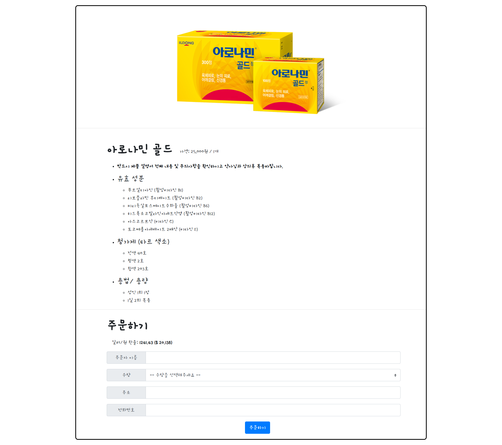
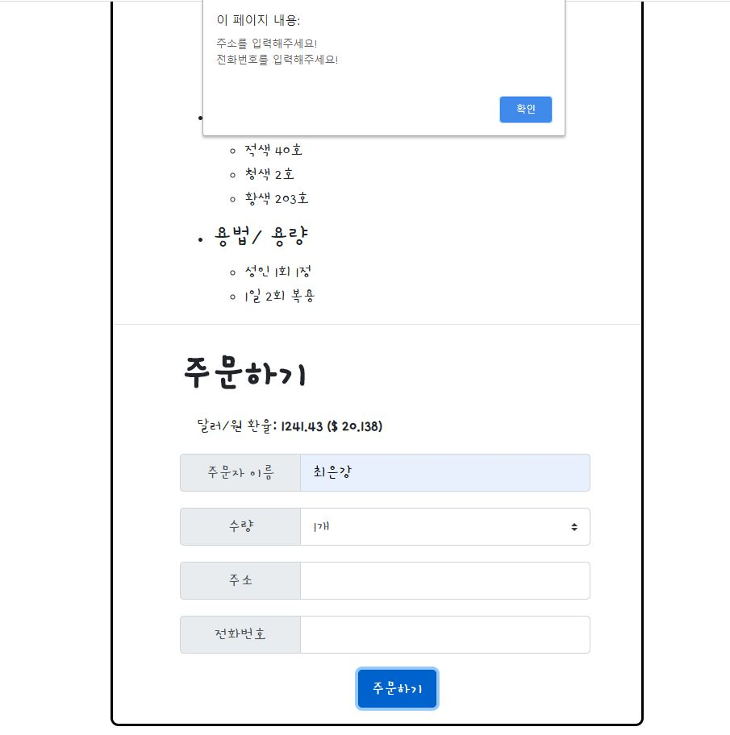

## 3회차 과제물
- 과제물 결과



- animation.js 코드 수정
- (이전코드 리뷰) 입력 누락시 어디가 누락되었는지 확인하는 메시지 출력
  - ex. 주문자 이름 누락 -> 주문자 이름을 입력하세요!

  

- 환율정보 나타내기
  - 소스코드
  - 달러환율이 만약 1300을 넘으면 빨간색 글씨로 표시.
```javascript
//환율정보 확인하는 페이지
//페이지 랜더링을 하게되면.
    $(document).ready(function(){
        let dollarSpan=$("#dollar_won");
        $.ajax({
            type:"GET",
            url:"https://api.manana.kr/exchange/rate.json",
            data:{},
            success: function(response){
                
                let dollarExchange= response[1]['rate'];
                let insertHtml;
                //달러 환율이 1300 이상이면 -> 글자를 빨간색으로 표시.
                if (dollarExchange>=1300){
                    insertHtml=`<strong class="higher-exchange">${dollarExchange} ($ ${(25000/dollarExchange).toFixed(3)})</strong>`;
                }else{
                    //1300 미만이라면 글자색깔 적용 x
                    insertHtml=`<strong>${dollarExchange} ($ ${(25000/dollarExchange).toFixed(3)})</strong>`;
                }
                
                dollarSpan.append(insertHtml);
            }
        });
    });
```
