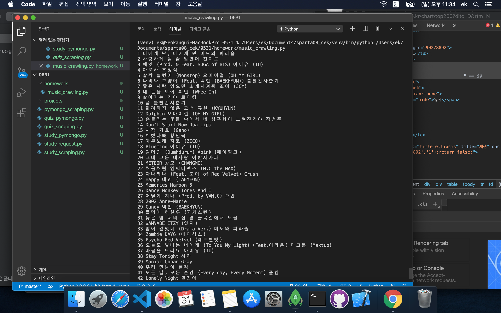
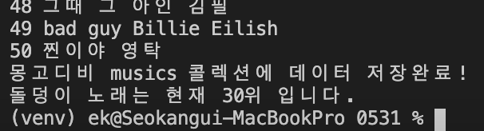
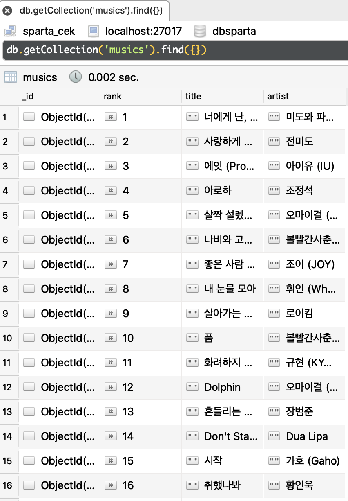

# 스파르타 4주차 숙제 - 지니뮤직 크롤링

## 1. 숙제 문제 풀이과정

- 지니뮤직 현재 음악 차트 순위 크롤링
  - 순위는 1로 시작하는 enumerate를 이용했습니다. (다행히도 none값이 나오는 데이터는 존재하지 않았습니다.)
  - 순위에 대한 데이터도 크롤링을 시도해봤지만, 출력결과 td.number 태그의 하위태그의 텍스트("유지, 1증가, 1감소")들도 같이 출력됩니다.
  <br>
  
  ```python
      rank=music.select_one('td.number').text.strip()
  ```
  - 순위는 그냥 인덱스로 enumerate하고, 나머지 제목(title)과 가수(artist)를 크롤링으로 했습니다.
  - print(f'{변수명}') 은 javascript의 backtic(`) 이용하는 것과 같습니다.
  
  <br>
  
  ```javascript
  // javascript의 backtick 사용방법: `<태그>${넣을 변수 및 값}</태그>`
  
  function addCard(){
    let img_url="이미지URL";
    let link_url="연결URL"
    let title="제목 문자열"
    let desc="요약 내용"
    let comment="코멘트"
    let tmp=`<div class="card">
              
              <div class="card-body">
                <a href="${link_url}" class="card-title">${title}</a>
                <p class="card-text">${desc}</p>
                <p class="card-text comment">${comment}</p>
              </div>
            `;
    ${'#cards-box'}.append(tmp); // 아이디가 card-box인 곳에 tmp를 추가하겠다.
  }
  ```
  
<br>


- 현재 기준 음악 차트순위 1~50위의 곡의 순위/곡 이름/ 가수이름 출력코드
  
```python
import requests
from bs4 import BeautifulSoup

# 지니뮤직 현재기준 top200
url='https://www.genie.co.kr/chart/top200?ditc=D&rtm=N'

# headers: 꼭 붙일 필요는 없지만, 사용자가 웹브라우저를 이용해서 크롤링을 하고 있음을 명시해준다.
headers = {'User-Agent' : 'Mozilla/5.0 (Windows NT 10.0; Win64; x64)AppleWebKit/537.36 (KHTML, like Gecko) Chrome/73.0.3683.86 Safari/537.36'}
data = requests.get(url ,headers=headers)

soup=BeautifulSoup(data.text , 'html.parser')

# class가 list인 tr 태그들을 모아놓은다.
musics= soup.select('#body-content > div.newest-list > div > table > tbody > tr.list')

for rank, music in enumerate(musics, 1):
    #곡제목
    title=music.select_one('td.info > a.title').text.strip()

    #가수
    artist=music.select_one('td.info > a.artist').text
    print(f'{rank} {title} {artist}')

```

<br>

- 결과 사진(1위~50위 곡차트 출력)




<br>

- mongoDB 사용하기
  - dbsparta 에서 musics라는 collection을 만들어서 저장했습니다.
  - 크롤링해서 얻은 데이터를 JSON형식으로 info 블록안에 모았고, 각각의 음악차트 정보(곡순위/곡이름/가수이름)를 저장했습니다.
  
  <br>
  
  ```python
  from pymongo import MongoClient
  client=MongoClient('localhost', 27017)
  db=client.dbsparta
  
  for rank, music in enumerate(musics, 1):
    #곡제목
    title=music.select_one('td.info > a.title').text.strip()

    #가수
    artist=music.select_one('td.info > a.artist').text
    print(f'{rank} {title} {artist}')


    # 음악차트 정보를 하나의 json형식으로 묶는다.
    # 딕셔너리 형태인데, 콜론(:)의 왼쪽에 있는 'rank', 'title', 'artist'는 딕셔너리의 key이고
    # 오른쪽은 딕셔너리의 value에 속한다.
    info={
        'rank':rank,
        'title': title,
        'artist':artist
    }

    # 몽고디비의 musics 콜렉션에 저장한다 (음악 차트 1개의 정보)
    db.musics.insert_one(info)
    
    # 첫실행에는 비어있는 music 콜렉션에 데이터를 추가할 수 있지만
    # 계속 실행되면 똑같은 데이터가 충돌되므로, 딱 한번만 실행할 수 있습니다.
    # 여기서 조금더 응용하자면, 데이터가 계속 변동되는걸 확인하는 코드도 추가해볼 예정입니다.
    # 즉 musics 콜렉션에 해당 음악이 이미 들어있는 상태인지 아닌지를 확인하는 코드말입니다.
  ```

<br>

- mongodb의 musics 콜렉션에서 조건에 맞는 데이터를 조회해보기
  - db.musics.find() 는 musics콜렉션에 저장된 모든 데이터를 조회합니다.
  - db.musics.find({조건식},{제외시킬 key 설정}) 는 조건식에 만족하는 특정데이터들중 False를 받은 키값을 제외한 나머지 키값에 대한 데이터만 불러옵니다.
  - 노래제목이 '돌덩이' 가 있는지 확인하고, 있다면 aritst 키를 제외한 나머지만 추출합니다.('title', 'rank' 키값에 대한 value만 추출)
  ```python
  # 조건식: {'title': '돌덩이'} => 'title'키값이 '돌덩이'인 데이터를 찾아라
  # 제외시킬 key 설정: {'artist':False} => 만족하는 데이터중, 'artist'키값은 제외한다. 즉, 'title', 'rank'키값을 가진 데이터만 불러온다.
  target= db.musics.find({'title':'돌덩이'},{'artist':False})
  
  print('{}노래는 현재 {}위 입니다.'.format(target['title'], target['rank'])
  ```

<br>


- 결과 사진 (원하는 곡 순위 출력)



<br>

- 결과 사진 ( robo3T에 dbsparta의 musics collection에 저장된 데이터 )




<HR>

## 2. 오늘 배운 내용 복습
> requests : python requests는 jQuery의 ajax(asynchronous)와 달리 동기 방식(synchronous)으로 되어있다. 
  - 동기방식(synchronous)
    - 순서대로 실행한다. 앞에꺼가 끝날때까지 기다려야한다.
    - 서버내부는 동기방식으로 되어있다.
    - python requests 라이브러리가 동기방식으로 되어있다.
    
  - 비동기방식(asynchronous)
    - 순서대로 실행은 하지만, 앞에꺼가 실행이 끝날 때까지 기다리지 않는 방식 (즉, 순서가 정해져있지 않음)
    - jquery의 ajax가 비동기 방식으로 되어있다.
    - 트래픽이 많은 서버에서는 비동기 방식으로 사용한다.
  
<BR>
<HR>
  
> BeautifulSoup : 웹스크래핑 라이브러리 (웹페이지의 특정 데이터를 추출하는 목적으로 사용)
- crawling
  - crawl: 기어가다
  - 웹페이지의 전부를 접근한다. (불특정 다수의 정보 접근)
  
  
- scraping
  - 특정정보만을 접근한다.

<HR>
 
> pymongo :  python언어로 mongodb에 저장된 데이터를 조작할 수 있다.
>> database : 데이터 저장소
- [요즘 많이 사용하는 데이터베이스 랭킹](https://db-engines.com/en/ranking)
- RDBMS (Relational Data Base Management System)
  - SQL 문법을 이용한다.
  - 엑셀형식으로 행과 열 2차원배열의 테이블 형태를 갖는다.
  - 모든데이터는 동일한 컬럼을 갖는다.
  - 직관적이며(유동적이지 않으며) 데이터가 일관성이 있다.
  - 금융/분석/통계에서 많이 사용된다.
  - RDBMS의 대표는 ORACLE/ MySQL / MariaDB/ PostgreSQL 이 있다.
      
- NoSQL
  - JSON형식이다. (딕셔너리 안에 딕셔너리가 있는 형태)
  - 유동적인 데이터를 다루는데 좋다. (데이터마다 컬럼개수가 다르다)
  - 게임 에서 많이 사용된다.
  - NoSQL의 대표는 MongoDB이다.
